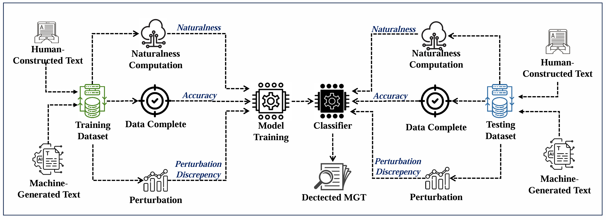

# DiscrimText: A Multi-Feature Framework for Enhanced Detection of Machine-Generated Text




DiscrimText is a novel approach for detecting machine-generated text (MGT) produced by large language models (LLMs) like ChatGPT, Claude, and others. Unlike traditional detection methods that rely on isolated linguistic features or simple probabilistic metrics, DiscrimText integrates three key features to improve detection performance:

- **Naturalness**: Quantifies the linguistic predictability of the text.
- **Prediction Accuracy**: Measures the Prediction Accuracy of text-completion models on the text.
- **Perturbation Discrepancy**: Evaluates the sensitivity of the text to minor perturbations.

## Machine-generated Text detection with DiscrimText

This repository contains instructions on how to classify contaminated data with **DiscrimText**, including how to access the dataset.
 
### 1. `Downloading the Datasets`

```bash
python Data_download.py --output_folder <path_to_output_folder>
```
### 2. `Downloading the n-gram training Datasets`
Download the N-gram text data to train the N-gram model using this link: [N-gram Text Data](https://drive.google.com/file/d/1huji6_lry_cjpNXC1nnYlO8tHQOHh5u5/view?usp=sharing)
```bash
python ngram_dataset.py --output_folder <path_to_output_folder>
```


### 3. `Train Dataset (for N-gram Model)`
This folder contains the data used to train the n-gram model. It includes various text files:

- Example files: `file1.txt`, `file2.txt`, etc.
To train the N-gram model, you can use the code provided in the [Ngram Model](https://github.com/naturalnessbasedappraoch/Natural-DaCode/tree/main/Source_code/n-gram_cachelm) repository. Follow the instructions in the repository to preprocess the data and train the model.

### 4. `Test Dataset (for Text Completion )`

The folder you download from script contains the test datasets for **ChatGPT3.5**. The test data is split into two categories:

- **Human-Constructed_Text**:
    - It contains text files.
    - Example files: `file1.txt`, `file2.txt`, etc.
- **Machine-Constructed_text**:
    - **Summarize Text**:
      - The text is passed through **Gemini** and **DeepSeek** models to generate a summary.
    - **Generate Text from Summary**:
      - After obtaining the summaries, we send these summaries back to the **Gemini** and **DeepSeek** models to generate a more readable and detailed version of the summary.

  


## Steps for Machine Generated Text Detection

### 1. **Naturalness, Prediction Accuracy and Perturbation Dicrepancy Computing**
   - **Naturalness:** Evaluate the naturalness scores for these text snippets using the N-gram model.
   - **Prediction Accuracy:** Calculate the token-level accuracy from text Generation Models(ChatGPT3.5 and Claude2).
   - **Perturbation Discrepancy:** Compute the difference of Log probability before and after the perturbation of text.

### 2. **Train the Classifier**
    - Combine performance metrics and naturalness scores.
    - Train an SVM classifier to distinguish between HCT and MGT.

### 3. **Predict Data Source**
-Use the trained SVM classifier to predict whether a text is HCT or MGT.

### 4. **Usage**
To perform MGT detection use the following scripts available in the repository:

   ```bash
   python Classifier.py --datasets_dir path_to_your_datasets_folder
```
